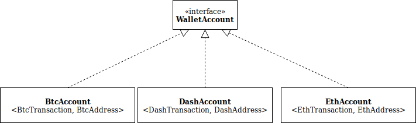

# Multi currency architecture

In order to support multiple asset classes, Mycelium Wallet has a set of abstract classes 
and interfaces to provide an ability if describing any type of asset.

An asset implementation involves *WalletAccount* interface methods' realization:

```
public interface WalletAccount<T extends GenericTransaction, A extends GenericAddress> {

    void completeAndSignTx(SendRequest<T> request) throws WalletAccountException;
    void completeTransaction(SendRequest<T> request) throws WalletAccountException;
    void signTransaction(SendRequest<T> request) throws WalletAccountException; 
    BroadcastResult broadcastTx(T tx) throws TransactionBroadcastException; 
    GenericAddress getReceiveAddress();
    CryptoCurrency getCoinType();
    Balance getAccountBalance();  
    T getTx(Sha256Hash transactionId); 
    List<GenericTransaction> getTransactions(int offset, int limit); 
    SendRequest getSendToRequest(GenericAddress destination, Value amount); 

    ...
}

```
The methods of WalletAccount cover all operations necessary to manage an asset. 
The Mycelium Wallet user is able to get the balance for the specific asset, get the list of transactions,
prepare a transaction by signing it and broadcast it to the network. 

Below is an example of some assets implementing *WalletAccount* interface:



